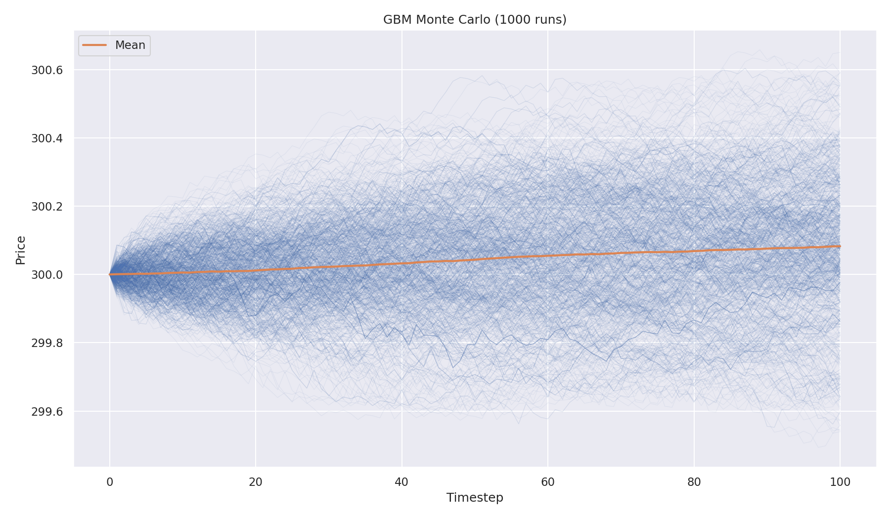

# Stock Price Simulator

[](https://isocpp.org/)



## Overview
This project implements a stock price simulator in C++. It currently supports GBM and ABM and simulates future price paths at customizable timesteps (seconds to days). The C++ core is exposed to Python via pybind11 bindings, which allows faster Monte Carlo simulations utilizing C++ multithreading and also visualization with Python's matplotlib.

I am working on improving the program so that the GBM/ABM parameters can be calculated from historical stock data instead of manually inputted.

## Key Features
- **Multiple Stochastic Models**: Geometric Brownian Motion (GBM) and Arithmetic Brownian Motion (ABM) with correct time-scaling.
- **Polymorphic Design**: Different models are derived from base class `PriceModel`
- **Flexible Simulation**: Configurable duration, timestep, and time units.
- **Python Bindings**: C++ core exposed to Python via pybind11 for easy scripting and integration.
- **Monte Carlo Simulation**: Run thousands of simulations with multithreaded execution for performance.
- **Visualization**: Interactive plotting with matplotlib/seaborn to visualize price paths and statistical distributions. 


## Technologies Used
- **Language**: C++17, Python 3
- **C++ Libraries**: Standard Library, pybind11, nlohmann/json
- **Python Libraries**: NumPy, Matplotlib, Seaborn
- **Build System**: CMake
- **Concurrency**: C++ `<thread>` for parallel Monte Carlo execution

## Performance

Monte Carlo simulation speedup comparison between single-threaded and multi-threaded execution:

| Simulations | Single Thread (s) | Multi Thread (s) |
|:------------|------------------:|-----------------:|
| 100       | 0.00121 | 0.000513 |
| 1,000      | 0.0124 | 0.0017 |
| 10,000     | 0.181 | 0.033 |
| 100,000   | 12.11 | 2.66 |

> **Hardware:** Apple Mac Mini (base model)  

## Quick Start

### Prerequisites
- CMake 3.15+
- C++17 compatible compiler
- Python 3.8+
- Git

### Build and Run

1. **Clone the repository**
   ```bash
   git clone <repository-url>
   cd Stock-Price-Simulator
   ```

2. **Build the C++ core**
   ```bash
   cmake -S . -B build -DCMAKE_BUILD_TYPE=Release
   cmake --build build --config Release -j
   ```

3. **Set up Python environment**
   ```bash
   cd python
   python3 -m venv venv
   source venv/bin/activate
   pip install -r requirements.txt
   ```

4. **Run the simulation**
   ```bash
   python run_simulation.py
   ```
   
   The script will prompt you for stock parameters (ticker, price, mu, sigma) and generate a visualization in `output/GBM/`.